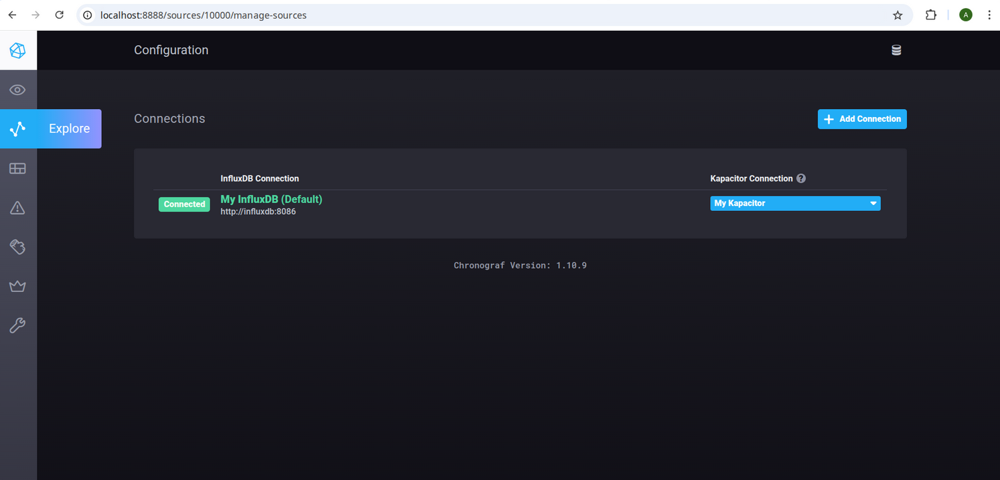
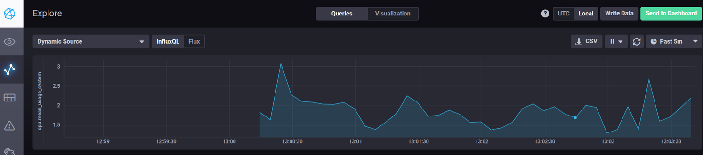
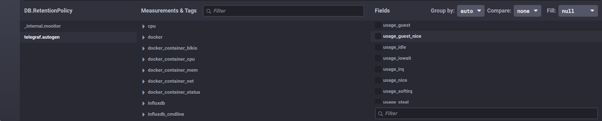

# Домашнее задание к занятию 13 "Системы мониторинга"

## 1. Минимальный набор метрик для платформы

- Доступность HTTP-сервиса: чтобы понимать, отвечает ли платформа вообще.
- Количество запросов (`RPS`): чтобы видеть текущую нагрузку на сервис.
- Время ответа (`latency`): чтобы понимать, как быстро платформа обслуживает клиентов.
- HTTP-коды ответов по группам `2xx`, `4xx`, `5xx`: чтобы видеть успешные запросы и ошибки.
- Загрузка CPU: потому что вычисления нагружают процессор, и это критичный ресурс для данной системы.
- Использование RAM: чтобы контролировать нехватку памяти и возможные утечки.
- Использование диска: отчеты сохраняются на диск, поэтому важно контролировать свободное место.
- `inodes`: если файлов будет много, диск может закончиться по inode раньше, чем по объему.
- Дисковый ввод-вывод (`disk I/O`): чтобы понимать, не упирается ли система в скорость записи и чтения.

## 2. Что предложить менеджеру продукта

Менеджеру лучше показывать не технические метрики, а продуктовые показатели и метрики SLA/SLI:

- процент успешных пользовательских запросов;
- процент отчетов, сформированных без ошибок;
- среднее и `p95` время подготовки отчета;
- доступность сервиса за период;
- доля запросов, обработанных в целевое время, например до 2 секунд;
- количество ошибок и количество успешных операций.

То есть вместо `CPU`, `RAM` и `inodes` ему нужен дашборд в терминах бизнеса: сервис доступен, отчеты формируются, клиенты получают результат вовремя, SLA выполняется.

## 3. Что делать без отдельной системы сбора логов

Самый практичный вариант: настроить отправку ошибок приложения в систему мониторинга, на почту или в мессенджер.

Например:

- приложение пишет ошибки в отдельный файл;
- агент на сервере читает этот файл;
- по шаблону `ERROR` или `Exception` отправляет событие в Zabbix, Prometheus Alertmanager, Telegram или email.

Если нужен совсем простой вариант, можно использовать `cron` или `tail/grep`-скрипт, который отслеживает новые ошибки и отправляет уведомления разработчикам.

## 4. Почему SLA не поднимается выше 70%, если нет 4xx и 5xx

Ошибка либо в формуле, либо в составе запросов, которые попали в знаменатель.

Если считать `summ_2xx_requests / summ_all_requests`, а `all_requests` включает не только `2xx`, `4xx`, `5xx`, но и, например, `1xx`, `3xx` или служебные запросы, то результат будет занижен.

Еще одна частая ошибка: часть успешных ответов может быть в `3xx`, а они не учитываются как успешные.

Для расчета HTTP SLA нужно заранее определить:

- какие коды считаются успешными;
- какие запросы входят в расчет;
- исключаются ли редиректы, `healthcheck` и внутренний трафик.

## 5. Плюсы и минусы pull- и push-моделей мониторинга

### Pull

Плюсы:

- система мониторинга сама забирает метрики;
- проще контролировать, кого и как опрашивать;
- удобно для Prometheus и `service discovery`;
- легко проверять доступность цели.

Минусы:

- системе мониторинга нужен сетевой доступ до всех целей;
- неудобно для короткоживущих задач;
- сложнее работать через `NAT` или закрытые контуры.

### Push

Плюсы:

- удобно, когда узел сам отправляет метрики наружу;
- подходит для batch-задач и короткоживущих процессов;
- проще в сетях, где нельзя подключаться к узлу извне.

Минусы:

- сложнее контролировать актуальность источников;
- труднее понять, узел умер или просто перестал отправлять метрики;
- выше риск дублей, мусора и несогласованности метрик.

## 6. Какие системы относятся к push, pull или гибридным

- `Prometheus` - в основном `pull`.
- `TICK` - в основном `push`.
- `Zabbix` - гибридная система: поддерживает и `pull`, и `push`.
- `VictoriaMetrics` - гибридная система: умеет принимать метрики по `push`, но часто используется вместе с `pull`-системами.
- `Nagios` - в основном `pull`.

## 7. Запуск TICK-стека

Ниже приведен скриншот веб-интерфейса `Chronograf` после запуска TICK-стека через `docker` и `docker compose`.



## 8. Метрики утилизации CPU в Chronograf

Ниже приведен скриншот из `Data explorer`, где выбраны:

- база `telegraf.autogen`;
- `measurement` `cpu`;
- `host` `telegraf-getting-started`;
- `field` `usage_system`.

На графике отображается утилизация CPU.



## 9. Метрики Docker в telegraf

В конфигурацию `telegraf` был добавлен плагин:

```toml
[[inputs.docker]]
  endpoint = "unix:///var/run/docker.sock"
```

После перезапуска `telegraf` в базе `telegraf.autogen` появились метрики, связанные с `docker`.


