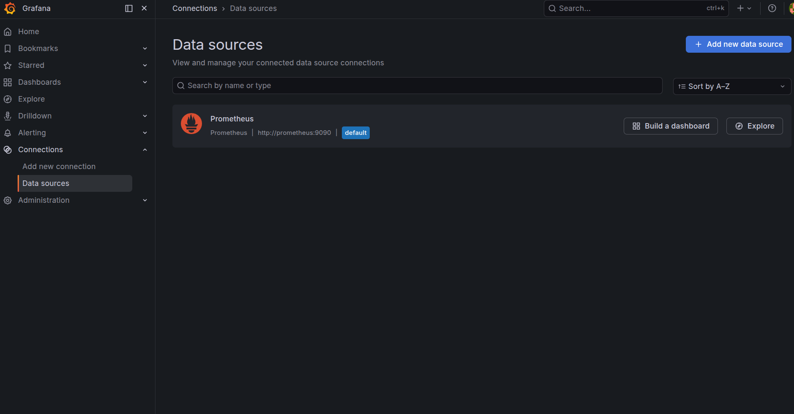
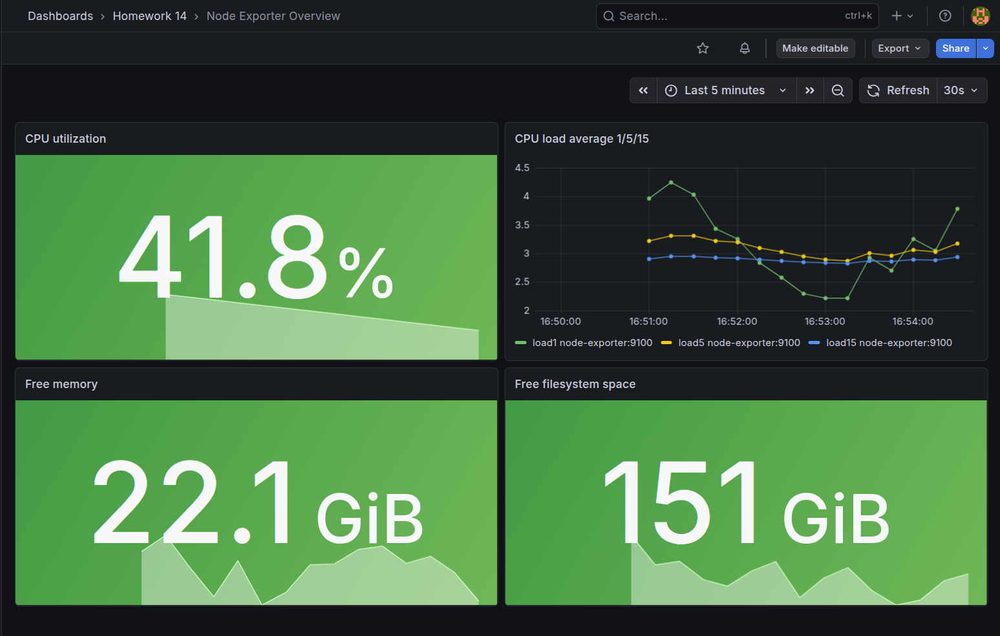
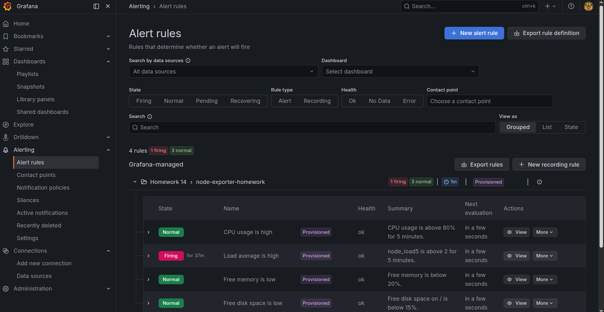
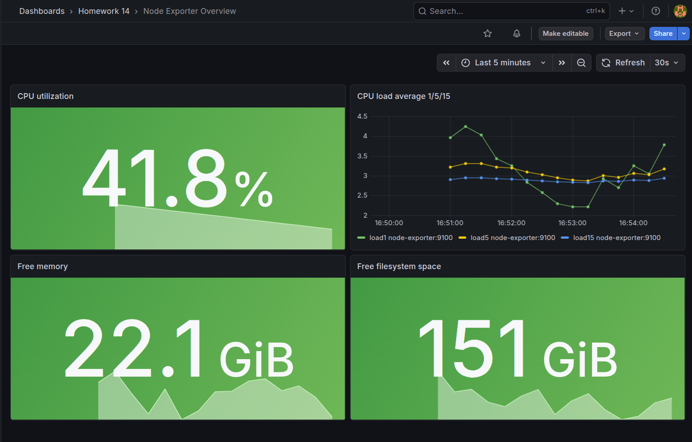
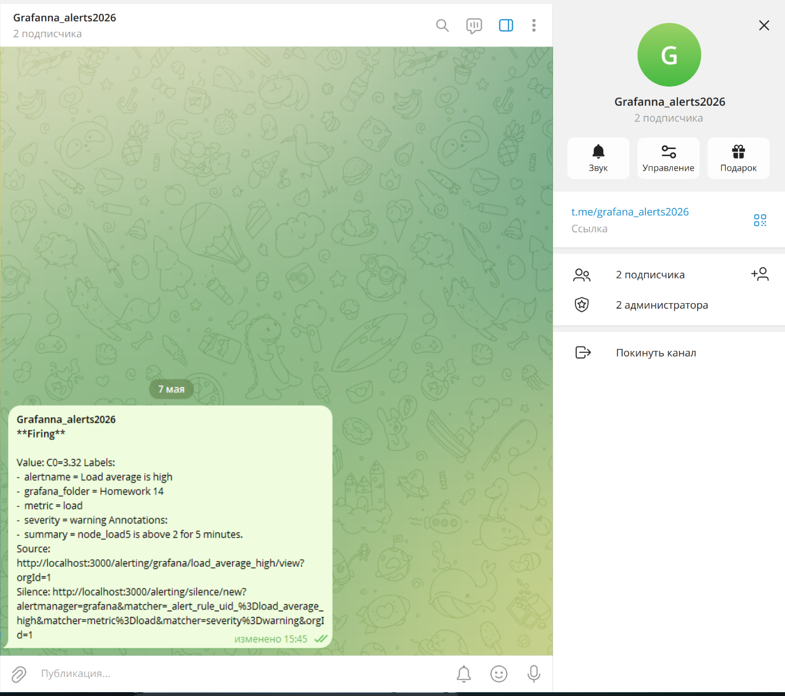

# Домашнее задание к занятию 14 «Средство визуализации Grafana»

Проект поднимает стек мониторинга из трех контейнеров:

- `grafana`
- `prometheus-server`
- `prometheus-node-exporter`

Источник данных для `Grafana` подключается автоматически через provisioning, dashboard импортируется из JSON, а alerting настраивается через файловый provisioning `Grafana Alerting`.

## Выполнение заданий

### Задание повышенной сложности

Проект развернут самостоятельно без использования директории `help` для сборки стенда.
Используются три контейнера:

- `grafana`
- `prometheus-server`
- `prometheus node-exporter`

Также в репозитории приведены все конфигурации и манифесты, использованные в решении:

- `docker-compose.yml`
- `prometheus/prometheus.yml`
- `grafana/provisioning/datasources/prometheus.yml`
- `grafana/provisioning/dashboards/dashboard.yml`
- `grafana/provisioning/alerting/contact-points.yml`
- `grafana/provisioning/alerting/policies.yml`
- `grafana/provisioning/alerting/rules.yml`
- `dashboards/node-exporter-dashboard.json`

## Состав проекта

- `docker-compose.yml` - запуск всего стенда
- `.env.example` - шаблон переменных окружения
- `prometheus/prometheus.yml` - конфигурация `Prometheus`
- `grafana/provisioning/datasources/prometheus.yml` - datasource `Prometheus`
- `grafana/provisioning/dashboards/dashboard.yml` - импорт dashboard
- `grafana/provisioning/alerting/` - contact point, notification policy и alert rules
- `dashboards/node-exporter-dashboard.json` - JSON model dashboard
- `img/` - каталог для скриншотов итогового решения

## Подготовка

Скопируйте шаблон переменных окружения:

```bash
cp .env.example .env
```

Заполните в `.env`:

- `GRAFANA_ADMIN_USER`
- `GRAFANA_ADMIN_PASSWORD`
- `GRAFANA_DOMAIN`
- `TELEGRAM_BOT_TOKEN`
- `TELEGRAM_CHAT_ID`

Для `TELEGRAM_CHAT_ID` в этом проекте ожидается строковый идентификатор канала в формате `@channel_username`.
Это соответствует рабочему варианту provisioning для `Grafana 12.4.1`.
Если нужен именно numeric `chat_id`, его проще добавить вручную через UI `Grafana Alerting`, так как в текущем образе файловый provisioning Telegram contact point ожидает строковое значение и стабильно работает со строковым `@channel_username`.

## Запуск и остановка

Запуск:

```bash
docker compose up -d
```

Остановка:

```bash
docker compose down
```

Проверка конфигурации:

```bash
docker compose config
```

## Доступ к сервисам

- `Grafana`: `http://localhost:3000`
- `Prometheus`: `http://localhost:9090`
- `node-exporter`: `http://localhost:9100/metrics`

## Авторизационные данные Grafana

Логин и пароль берутся из файла `.env`:

- логин: значение `GRAFANA_ADMIN_USER`
- пароль: значение `GRAFANA_ADMIN_PASSWORD`

## Datasource

После запуска в `Grafana` автоматически создается datasource:

- `Prometheus` -> `http://prometheus:9090`

Скриншот со списком datasource:



## Dashboard

Автоматически импортируется dashboard `Node Exporter Overview` со следующими панелями:

- утилизация CPU, `%`
- `CPU load average 1/5/15`
- объем свободной оперативной памяти
- свободное место на файловой системе

Скриншот итоговой dashboard:



## PromQL-запросы

### CPU utilization, %

```promql
100 - (avg by(instance) (rate(node_cpu_seconds_total{mode="idle"}[5m])) * 100)
```

### CPU load average 1/5/15

```promql
node_load1
node_load5
node_load15
```

### Free memory

```promql
node_memory_MemAvailable_bytes
```

### Free filesystem space

```promql
node_filesystem_avail_bytes{fstype!~"tmpfs|fuse.lxcfs|overlay",mountpoint="/"}
```

Примечание: в проекте алерт по диску вычисляет процент свободного места на `/`:

```promql
(node_filesystem_avail_bytes{fstype!~"tmpfs|fuse.lxcfs|overlay",mountpoint="/"} / node_filesystem_size_bytes{fstype!~"tmpfs|fuse.lxcfs|overlay",mountpoint="/"}) * 100
```

Если на конкретной системе корневой `mountpoint` отличается, запрос нужно адаптировать под фактическое значение, которое видно в метриках `node_exporter`.

## Alerting

В проекте создаются 4 alert rules:

- `CPU usage is high` - CPU выше `80%` в течение `5m`
- `Load average is high` - `node_load5 > 2` в течение `5m`
- `Free memory is low` - свободная память ниже `20%`
- `Free disk space is low` - свободное место на `/` ниже `15%`

Канал уведомлений:

- `Telegram`

Контактная точка создается provisioning-файлом `grafana/provisioning/alerting/contact-points.yml`.
Перед тестом алертов создайте Telegram-канал с публичным username, добавьте туда бота и укажите этот username в `.env`, например `TELEGRAM_CHAT_ID=@my_monitoring_alerts`.

Скриншот списка alert rules:



Скриншот итоговой dashboard:



Скриншот тестового уведомления:



## Проверка

После запуска рекомендуется проверить:

```bash
docker compose ps
curl -s http://localhost:9090/api/v1/targets | jq .
curl -s http://localhost:3000/api/health
```

Ожидаемый результат:

- все 3 контейнера находятся в состоянии `Up`
- `Prometheus` видит `node-exporter` в статусе `UP`
- dashboard загружен автоматически
- alert rules присутствуют в `Alerts & IRM -> Alert rules`

## JSON model dashboard

Ниже приведен полный JSON model dashboard из файла `dashboards/node-exporter-dashboard.json`.

```json
{
  "annotations": {
    "list": [
      {
        "builtIn": 1,
        "datasource": {
          "type": "grafana",
          "uid": "-- Grafana --"
        },
        "enable": true,
        "hide": true,
        "iconColor": "rgba(0, 211, 255, 1)",
        "name": "Annotations & Alerts",
        "type": "dashboard"
      }
    ]
  },
  "editable": false,
  "fiscalYearStartMonth": 0,
  "graphTooltip": 0,
  "id": null,
  "links": [],
  "panels": [
    {
      "datasource": {
        "type": "prometheus",
        "uid": "prometheus"
      },
      "fieldConfig": {
        "defaults": {
          "color": {
            "mode": "thresholds"
          },
          "mappings": [],
          "max": 100,
          "min": 0,
          "thresholds": {
            "mode": "absolute",
            "steps": [
              {
                "color": "green",
                "value": null
              },
              {
                "color": "orange",
                "value": 80
              },
              {
                "color": "red",
                "value": 90
              }
            ]
          },
          "unit": "percent"
        },
        "overrides": []
      },
      "gridPos": {
        "h": 8,
        "w": 12,
        "x": 0,
        "y": 0
      },
      "id": 1,
      "options": {
        "colorMode": "background",
        "graphMode": "area",
        "justifyMode": "auto",
        "orientation": "auto",
        "reduceOptions": {
          "calcs": [
            "lastNotNull"
          ],
          "fields": "",
          "values": false
        },
        "textMode": "auto"
      },
      "pluginVersion": "12.0.0",
      "targets": [
        {
          "datasource": {
            "type": "prometheus",
            "uid": "prometheus"
          },
          "editorMode": "code",
          "expr": "100 - (avg by(instance) (rate(node_cpu_seconds_total{mode=\"idle\"}[5m])) * 100)",
          "legendFormat": "{{instance}}",
          "range": true,
          "refId": "A"
        }
      ],
      "title": "CPU utilization",
      "type": "stat"
    },
    {
      "datasource": {
        "type": "prometheus",
        "uid": "prometheus"
      },
      "fieldConfig": {
        "defaults": {
          "color": {
            "mode": "palette-classic"
          },
          "mappings": [],
          "thresholds": {
            "mode": "absolute",
            "steps": [
              {
                "color": "green",
                "value": null
              },
              {
                "color": "red",
                "value": 2
              }
            ]
          },
          "unit": "short"
        },
        "overrides": []
      },
      "gridPos": {
        "h": 8,
        "w": 12,
        "x": 12,
        "y": 0
      },
      "id": 2,
      "options": {
        "legend": {
          "calcs": [],
          "displayMode": "list",
          "placement": "bottom",
          "showLegend": true
        },
        "tooltip": {
          "mode": "single",
          "sort": "none"
        }
      },
      "pluginVersion": "12.0.0",
      "targets": [
        {
          "datasource": {
            "type": "prometheus",
            "uid": "prometheus"
          },
          "editorMode": "code",
          "expr": "node_load1",
          "legendFormat": "load1 {{instance}}",
          "range": true,
          "refId": "A"
        },
        {
          "datasource": {
            "type": "prometheus",
            "uid": "prometheus"
          },
          "editorMode": "code",
          "expr": "node_load5",
          "legendFormat": "load5 {{instance}}",
          "range": true,
          "refId": "B"
        },
        {
          "datasource": {
            "type": "prometheus",
            "uid": "prometheus"
          },
          "editorMode": "code",
          "expr": "node_load15",
          "legendFormat": "load15 {{instance}}",
          "range": true,
          "refId": "C"
        }
      ],
      "title": "CPU load average 1/5/15",
      "type": "timeseries"
    },
    {
      "datasource": {
        "type": "prometheus",
        "uid": "prometheus"
      },
      "fieldConfig": {
        "defaults": {
          "color": {
            "mode": "thresholds"
          },
          "mappings": [],
          "thresholds": {
            "mode": "absolute",
            "steps": [
              {
                "color": "red",
                "value": null
              },
              {
                "color": "orange",
                "value": 2000000000
              },
              {
                "color": "green",
                "value": 4000000000
              }
            ]
          },
          "unit": "bytes"
        },
        "overrides": []
      },
      "gridPos": {
        "h": 8,
        "w": 12,
        "x": 0,
        "y": 8
      },
      "id": 3,
      "options": {
        "colorMode": "background",
        "graphMode": "area",
        "justifyMode": "auto",
        "orientation": "auto",
        "reduceOptions": {
          "calcs": [
            "lastNotNull"
          ],
          "fields": "",
          "values": false
        },
        "textMode": "auto"
      },
      "pluginVersion": "12.0.0",
      "targets": [
        {
          "datasource": {
            "type": "prometheus",
            "uid": "prometheus"
          },
          "editorMode": "code",
          "expr": "node_memory_MemAvailable_bytes",
          "legendFormat": "{{instance}}",
          "range": true,
          "refId": "A"
        }
      ],
      "title": "Free memory",
      "type": "stat"
    },
    {
      "datasource": {
        "type": "prometheus",
        "uid": "prometheus"
      },
      "fieldConfig": {
        "defaults": {
          "color": {
            "mode": "thresholds"
          },
          "mappings": [],
          "thresholds": {
            "mode": "absolute",
            "steps": [
              {
                "color": "red",
                "value": null
              },
              {
                "color": "orange",
                "value": 10000000000
              },
              {
                "color": "green",
                "value": 20000000000
              }
            ]
          },
          "unit": "bytes"
        },
        "overrides": []
      },
      "gridPos": {
        "h": 8,
        "w": 12,
        "x": 12,
        "y": 8
      },
      "id": 4,
      "options": {
        "colorMode": "background",
        "graphMode": "area",
        "justifyMode": "auto",
        "orientation": "auto",
        "reduceOptions": {
          "calcs": [
            "lastNotNull"
          ],
          "fields": "",
          "values": false
        },
        "textMode": "auto"
      },
      "pluginVersion": "12.0.0",
      "targets": [
        {
          "datasource": {
            "type": "prometheus",
            "uid": "prometheus"
          },
          "editorMode": "code",
          "expr": "node_filesystem_avail_bytes{fstype!~\"tmpfs|fuse.lxcfs|overlay\",mountpoint=\"/\"}",
          "legendFormat": "{{instance}}",
          "range": true,
          "refId": "A"
        }
      ],
      "title": "Free filesystem space",
      "type": "stat"
    }
  ],
  "refresh": "30s",
  "schemaVersion": 41,
  "style": "dark",
  "tags": [
    "homework",
    "node-exporter",
    "prometheus"
  ],
  "templating": {
    "list": []
  },
  "time": {
    "from": "now-15m",
    "to": "now"
  },
  "timepicker": {},
  "timezone": "",
  "title": "Node Exporter Overview",
  "uid": "nodeexporterhw14",
  "version": 1,
  "weekStart": ""
}
```